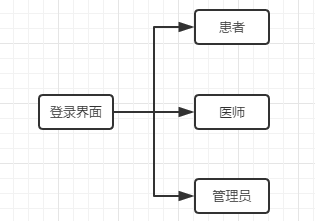
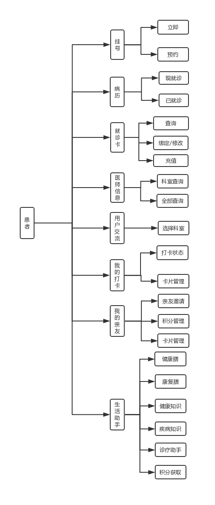
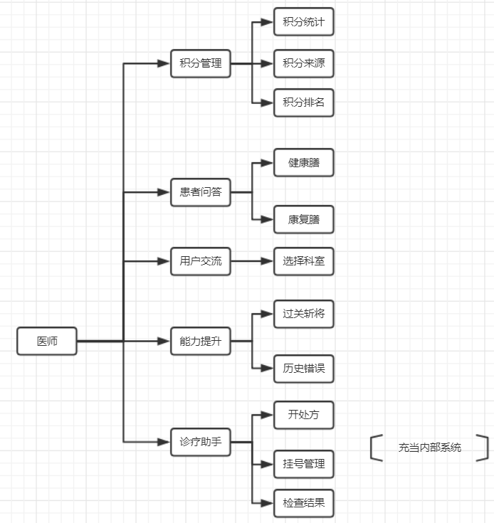
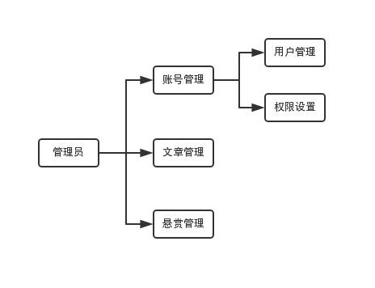
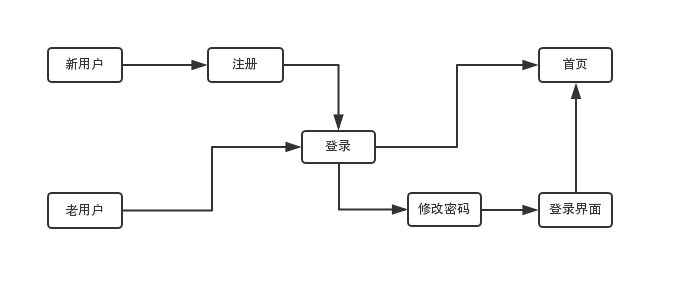
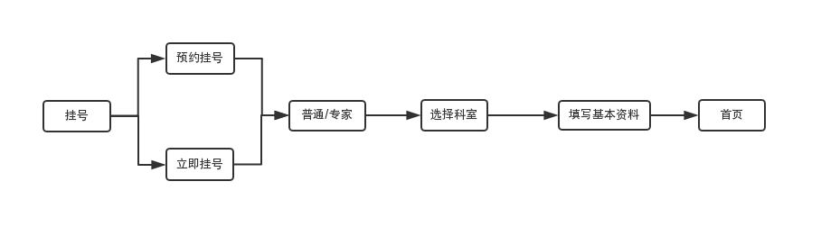
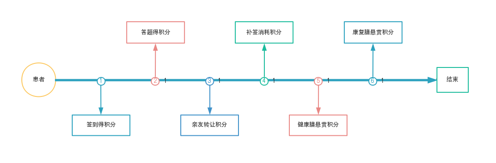
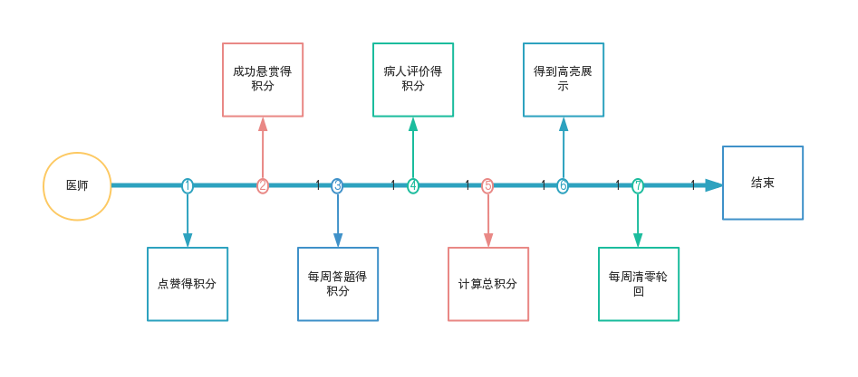

# 目的
   为了更方便的建设网站，完成网站的各项需求，将对网站所需要的各项功能与流程进行分析、规划。

# 需求背景
   手机电脑早已普及的今天，现代人们生活的方方面面都离不开网络，许多社会活动在今天也能依靠网络实现，足不出户便能做到许多事，即省事省力，又方便快捷，而且也减少了了各部门的前台压力。作为保障人民身体健康的医院部门自然也要与时俱进，给患者朋友提供更加便捷的服务。因此，便出现了线上门诊系统，供患者和医院使用，让看病变得更加顺利，让医院更好的管理各项工作。

# 开发环境及技术
   开发环境：win10
   开发技术：jsp、css、html5、mysql。。。。。。（待补充）

# 系统功能与流程

# 总览
  
  
  
  

#### 登录界面
功能：
负责注册，登录与修改密码，验证码等功能，用户通过选择身份后输入账号与密码进入系统，身份有患者与医师，管理员（注册账号，密码，院名，所在地）三种。
1、注册：（注册之前进行实名），科室（医师独有），姓名，出生年月，联系电话，邮箱，账号，密码。
2、登录：身份选择（管理员无此选项），账号，密码，选择是否记住密码。登陆之后用户名为注册顺位（即第一个注册的为1，第二个注册的为2），可随时修改，不能重合。
3、修改密码（两种验证方式）：密保问题验证，邮箱验证，新密码。
流程：
   

#### 首页界面

参考湖科大教务系统，右上角显示用户头像，姓名，年龄，性别，民族，点击头像显示用户基本信息（注册的信息），可修改，在合适位置添加打卡按钮。

#### 功能模块（患者）

A、挂号（普通，专家或指定医师）

功能：分为预约挂号与立即挂号，患者选择挂号选项，填写基本资料付费（无医保卡，有医保卡，通过就诊卡）完成后生成当日该科室患者唯一编号，可退费（清空挂号信息），转挂号（挂错号，重新付费，已付金额退回）。挂号完成后患者仍可修改自己的基本信息，可预约挂号（在线，人工电话）。
内容：编号[日期科室种类顺序号]，姓名，年龄，性别，科室类别，科室名。
复诊患者可直接凭此号再次看相同医师。
种类：内科(A)、普外科(B)、骨科(C)、神经内科(D)、神经外科(E)、心胸外科(F)、泌尿科(G)、妇产科(H)、眼科(I)、耳鼻喉科(J)、理疗科(K)、小儿科(L)、中医科(M)。
流程：
  

B、病历

功能：查询当前以及过去通过本系统看病的该用户的病历情况，可打印，同时完成就诊后，可通过此版块对医师进行评价（不满意，一般，满意，超赞。一般1积分，满意2积分，超赞4积分）。
包括现就诊状态，已就诊状态。内容包括检查结果，处方信息，在这个地方直接添加与开出处方医师的信息交流界面的连接（名字的超链接）。

C、就诊卡

功能：相当于vip卡，可打折，充值。可绑定或更换就诊卡，查询状态，交易流水，充值。分为：状态查询（卡号，姓名，余额），绑定就诊卡（更换），查询流水，充值，修改密码。

D、医师信息

功能：按科室分类查询或全部查询，患者可通过此功能查询该医院所有医师的信息（照片，姓名，性别，履历详情，主要成就，擅长方向，毕业院校，联系电话）。可以展示医院实力的同时，方便患者选择挂号的目标医师。

E、用户交流

功能：不显示患者染病情况，只显示基础信息，医师信息调用D中的信息，只有发帖，回帖，加好友，搜索，点赞，举报，删除，实时交流（对话框）功能，患者和医师都能够在此进行交流，其中医师的发帖和回帖，每被点赞一次，医师积分加0.1点，患者每签到一次积分加1分，连续签到7天额外获得3分。为了保护隐私所有用户可以选择是否对外开放和其他用户交流或者只和好友交流（方便特殊病症患者交流），选择不开放或只和好友交流的用户将只能看其他帖子，不能进行所有互动，比如回帖，点赞。

F、我的打卡

功能:患者用户通过打卡来获得有一定期限的打折卡，打卡一次获得1积分，一周一小结（每连续签到7天获得9.8折优惠，期限7天），一月一大结（每连续签到一个月获得9.2折优惠，期限30天），可通过积分补签，每补签一次消耗积分5点。患者用户通过此模块查看个人签到状况，进行补签，所有打折卡仅可用于500元以下的医疗费用。

G、我的亲友

功能：分配给每一个用户独有的邀请码，每邀请一个新用户（即亲友），该用户永久减少0.2%医疗费用（一万块费用以下，超过一万块按0.1%算），每个用户邀请上限5个（因为系统实名，不用担心刷人数）。
亲友之间可以转让积分，每天上限转出5个积分，转入25个积分，每一次性转让达到5点积分（转让的积分不能发生二次流动），双方亲密度加1点，亲密度达到10点，双方每天的积分转让上限增加到10积分（高于5积分的部分不算进个人上限，比如转让6积分，多出的1积分不算进上限里，被转让的用户当日仍可转入20积分），亲密度达到40点，可转让周打折卡。点击亲友列表的头像调出对话框（支持离线消息）。

H、生活助手（优势在于有正规执照医师把关，可靠度高）

功能：这部分是患者和医师重要的积分来源，分为健康膳（针对一般用户），康复膳（针对患者用户），疾病知识（定期发布关于疾病的冷门知识），健康知识（定期发布关于保持身体健康的），答题，诊疗助手（通过此版块可以查看各种检查结果，相关医嘱提醒，复查提醒等）6个部分。

患者用户通过答题的方式获取积分，每答对一道题获得1积分，每天3道，题库从疾病知识，健康知识中调出（即患者用户每天不靠亲友可以获得5积分，答题3分，交流中心签到1分，打卡1分）。

健康膳（可匿名）中，定期发布健康膳知识，比如适合高血压患者的食品的料理做法，适合骨质疏松人群的菜品，甚至肥胖人群等等针对身体有任何不适人群的食物知识。有特殊需求的用户（比如肥胖，不能吃太多蛋白质等），可以使用积分悬赏专业医师为其制定合适的食物推荐方案。医师们将制定好的食物方案发送给患者用户，由患者用户选择（只有该用户才能看到），患者用户可与‘投标’医师交流，被选择的医师获得悬赏积分。（此部分派专人管理文章，即发布与删除）

康复膳则只能悬赏（可匿名，保护隐私），并且签订相关条约，对于正在就诊中的患者可免费获得来自当前就诊医师的指导，期限一个月。若用户当前没有就诊或帮其他人（比如亲戚朋友孩子）挂号，悬赏康复膳时必须支付与健康膳同样的积分，规则一样。不同的是，用户必须将患者的过敏物，患病情况真实的告诉医师，否则一旦出问题，用户责任自但。

以上悬赏当医师‘投标’后，患者（匿名）与医师通过对话框交流。
  

#### 功能模块（医师）
##### 积分管理
功能：负责管理医师个人的积分。具有统计积分总和，积分来源记录（来源：点赞，悬赏，诊疗评价，做题），所在科室积分排名（不足3人显示空白），查看医院前50名积分信息，查询历史积分排名的功能。
每周清零一次，本周全院积分前30名的医师，将获得下周一周首页轮流展示的机会。在患者用户的D版块，即医师信息版块中，相应科室前3名将获得前排高亮展示机会（不足3人无此功能）。 
##### 患者问答
功能：分为健康膳，康复膳两部分。可以通过此版块查看患者用户和一般用户发布的悬赏，‘投标’后，通过对话框与其交流，被选择后获得相应积分。
##### 用户交流
功能：参与患者的用户交流版块，给出相应意见，获得每一次点赞，积分加0.1。所有医师头像统一白大褂蓝底，并有特殊头像框（防止患者用户高仿）
##### 能力提升
每周发布一套医师用户相应科室的试题（80~90分合格，90以上分优秀），合格5积分，优秀10积分，连续3次不合格将通知相应科室主管。不管上周有没有完成，下周重新发布试题，每位医师每月至少完成一套试题。错误的题目和当期分数保存下来。 
  
##### 内部模拟（充当内部系统的一部分功能）
有开处方，录入检查结果2个功能，当医师点击保存时，患者客户端方提示对医师此次诊疗做出评价。

#### 管理员模块
功能：负责用户信息管理，可以对所有用户账号信息进行删除，查询（只能查询到用户名，密码等是无法查询的），冻结操作。并拥有赋予用户账号冻结权限的能力（将冻结权限提供给相应科室主管），每个科室的主管管理自己科室的所有用户，包括患者和医师（即可以冻结其账户，删除其在用户交流和生活助手模块的发言和悬赏）。

同时有能力管理健康膳（删除文章和悬赏），康复膳（删除悬赏）和用户交流模块（更换科室管理人账号）。（前两个模块的管理一般交给相应科室主管，即管理人）
